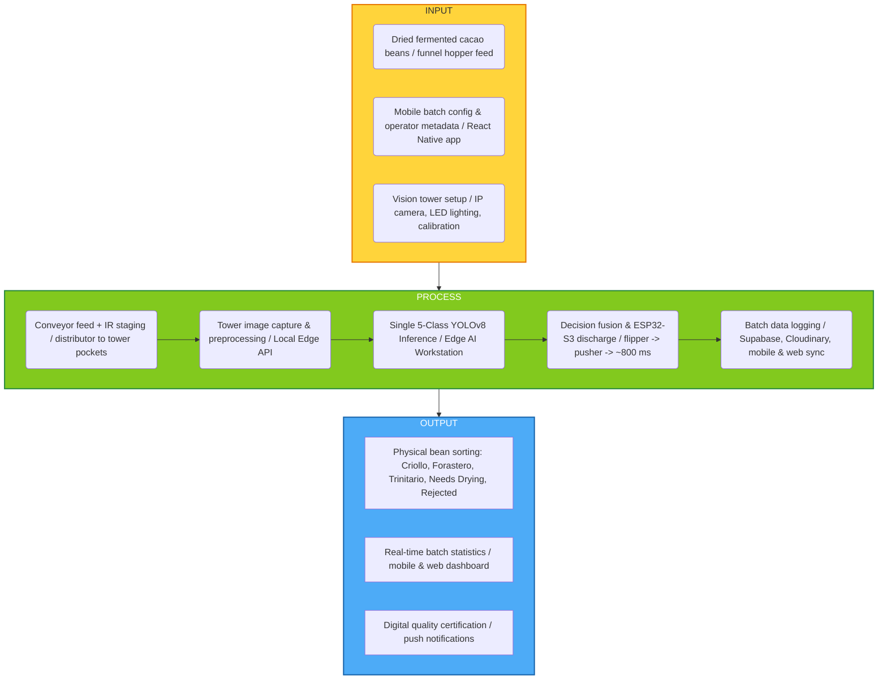
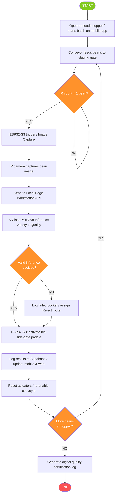
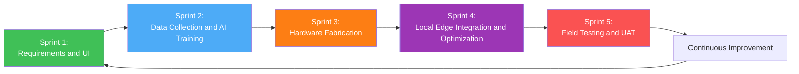
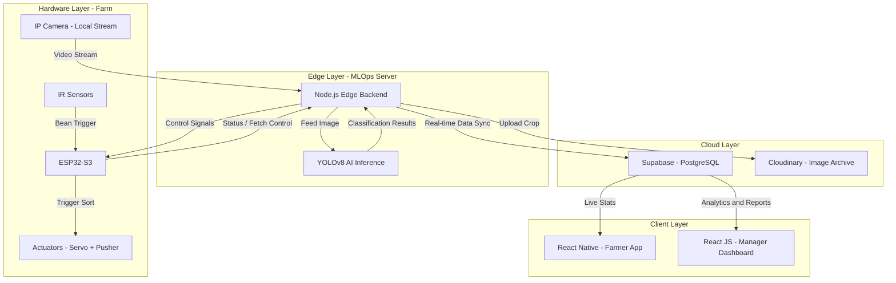
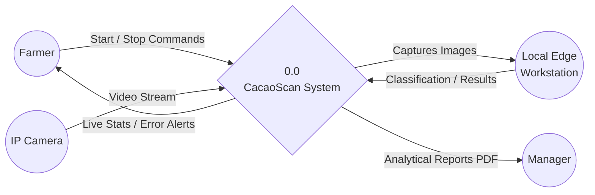
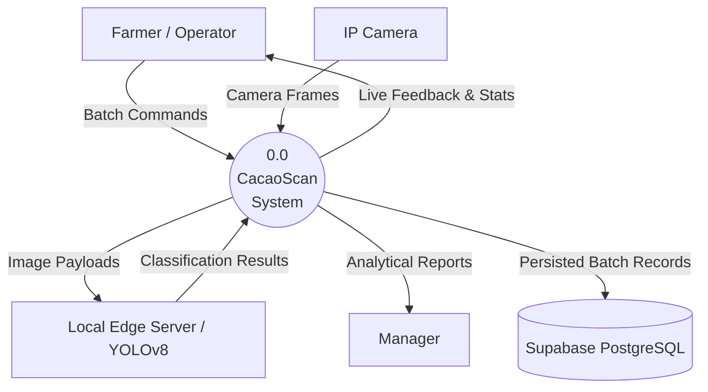
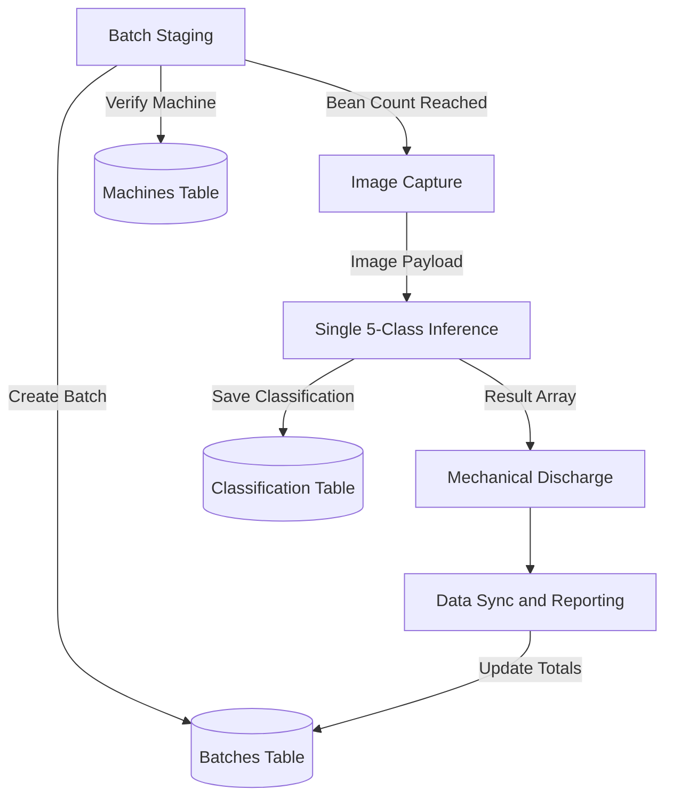
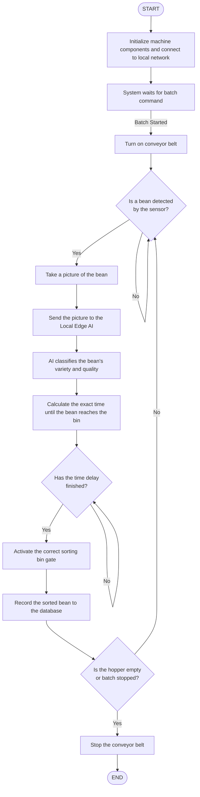
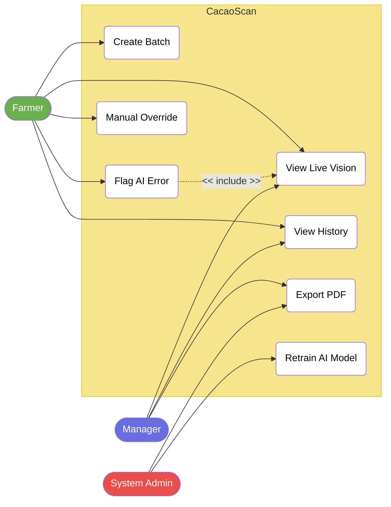
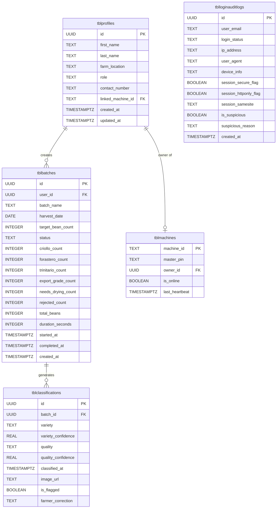

# **TABLE OF CONTENT** 

|INTRODUCTION 1|
|---|
|**1.1 Project Context........................................................................................... 1**|
|**1.2 Statement of the Problem.......................................................................... 2**|
|**1.3 Purpose and Description........................................................................... 3**|
|**1.4 Objectives................................................................................................... 5**|
|**1.4.1 Specific Objectives..........................................................................................6**|
|**1.5 Scope and Limitation................................................................................. 6**|
|**1.6 Significance of Study................................................................................. 8**|
|**1.7 Definition of Terms..................................................................................... 9**|
|CHAPTER 2 13|
|REVIEW OF RELATED LITERATURE AND SYSTEMS 13|
|**2.1 Introduction...............................................................................................13**|
|**2.1.1 Computer Vision and Deep Learning for Agricultural Quality Assessment**|
|**14**|
|**2.1.2 YOLO Object Detection Architecture...........................................................14**|
|**2.1.3 Internet of Things and Edge Inference........................................................ 15**|
|**2.1.4 Post-Harvest Cacao Grading Standards..................................................... 15**|
|**2.1.5 Automated Sorting and AIoT Integration.................................................... 16**|
|**2.1.6 YOLOv8 Postharvest Defect Detection........................................................17**|
|**2.1.7 Artificial Vision for Cacao Bean Classification...........................................18**|
|**2.1.8 IoT-Integrated Citrus Sorting System in the Philippines........................... 19**|
|**2.1.9 Philippine Cacao Industry Roadmap........................................................... 20**|
|**2.1.10 Deep Computer Vision System for Cocoa Classification........................ 21**|

|**2.1.11 Cocoa Bean Classification Using Enhanced Feature Extraction............21**|
|---|
|**2.1.13 Cocoa Bean Quality Identification Using HSV and GLCM.......................22**|
|**2.1.14 Real-Time Automatic Citrus Grading-Sorting Machine............................23**|
|**2.1.15 Real-Time Fruit Grading Using Deep Learning on Raspberry Pi............ 23**|
|**2.1.16 YOLOv8 Cherry Defect Detection for Intelligent Sorting......................... 23**|
|**2.1.17 YOLOv8-Orah Mandarin Postharvest Defect Detection...........................24**|
|**2.1.18 Multi-Scale Attention-Augmented YOLOv8 for Soybean Defect Detection**|
|**24**|
|**2.1.19 Real-Time Crop Sorting with ESP32-CAM and Deep Learning............... 24**|
|**2.1.20 Edge AI Sorting on ESP32-CAM.................................................................25**|
|**2.1.21 Intelligent Banana Postharvest Sorting Using Thermal Imaging and CNN**|
|**25**|
|**2.1.22 Deep-Learning Wireless Visual Sensor for Mushroom Sorting.............. 26**|
|**2.1.23 Multi-Object Robot Sorting Based on Deep Learning..............................26**|
|**2.1.24 Deep Learning Fruit Detection Review......................................................26**|
|**2.1.25 CNN-Based Detection in Fresh Fruit Production Review........................ 27**|
|**2.2 Summary................................................................................................... 28**|
|**2.3 Synthesis...................................................................................................29**|
|CHAPTER 3 31|
|TECHNICAL BACKGROUND 31|
|**3.1 Conceptual Framework............................................................................31**|
|**3.2 Technology Requirements.......................................................................34**|
|**3.2.1 Network Architecture and End Users.......................................................... 37**|
|**3.3 Summary................................................................................................... 38**|
|CHAPTER 4 39|

|DESIGN AND METHODOLOGY 39|
|---|
|**4.1 Research Design...................................................................................... 39**|
|**4.2 Developmental Methodology...................................................................39**|
|**4.3 System Architecture.................................................................................40**|
|**4.4 Data Collection Methods..........................................................................42**|
|**4.5 Data Analysis............................................................................................44**|
|**4.5.1 Context Diagram............................................................................................44**|
|**4.5.2 Data Flow Diagram........................................................................................ 45**|
|**4.5.3 System Flowchart..........................................................................................46**|
|**4.5.4 Use Case.........................................................................................................47**|
|**4.6 Requirement Specification...................................................................... 53**|
|**4.6.1 Functional Requirements..............................................................................53**|
|**4.6.2 User Characteristics......................................................................................55**|
|**4.6.3 Non-Functional Requirements..................................................................... 55**|
|**4.7 System Design..........................................................................................56**|
|**4.7.1 Database Field Tables................................................................................... 57**|
|**4.7.2 Hardware Interface........................................................................................ 60**|
|**4.8 Tools and Technology..............................................................................61**|
|**4.9 Evaluation and Testing.............................................................................61**|
|REFERENCES 62|

# **CHAPTER 1** 

# **INTRODUCTION** 

# **1.1 Project Context** 

Zamboanga City is rapidly positioning itself as a major hub for cacao production and chocolate manufacturing in the Zamboanga Peninsula. [1] According to the Department of Agriculture, the quality of fermented cacao beans is the single most important factor in determining their market price and export potential. [2] High-quality beans require precise fermentation and drying processes to achieve the chemical profiles necessary for premium chocolate production. For the local industry to thrive and compete globally, ensuring that only the highest grade of beans reaches the market through an affordable YOLOv8-based automated sorting system is an essential economic requirement for Zamboanga cooperatives and smallholder farmers. 

However, the majority of local cacao farmers and small-scale cooperatives in Zamboanga still rely on manual sorting and subjective visual inspection to grade their beans. This manual process is slow, inconsistent, and highly prone to human error, where defects such as mold, shriveled beans, or uneven fermentation are frequently missed during prolonged inspection tasks [5]. Research and national grading practice show that surface defects covered by PNS/BAFS 58:2019, including mold and related quality failures, can compromise batch acceptability when defective beans remain mixed into export-oriented lots [6]. This results in significant financial losses for Zamboanga farmers who lack access to professional, automated grading equipment at the local cooperative level, despite industry recognition that bean quality is central to market competitiveness [2]. 

Current technological solutions in the local cacao industry are mostly limited to basic moisture meters, which only measure one specific aspect of bean quality. A significant research gap exists because existing software-only cacao and cocoa vision systems can classify beans on screen but do not provide a complete physical sorting solution [13], [14], [16], [18]. Furthermore, although automated grading-sorting machines and IoT-assisted physical sorters have been demonstrated for other crops, industrial-grade systems remain difficult for small- to medium-scale Zamboanga cooperatives to acquire, while low-cost microcontroller sorters still leave cacao-specific variety and PNS-aligned defect sorting unresolved [15], [19], [24]. There is a clear need for an integrated, low-cost automated machine that can perform both variety identification and physical grading-based sorting autonomously without requiring constant human labor at barangay-level processing facilities. 

The research niche of this study lies in cooperative-scale post-harvest analysis for the three Philippine cultivar groups cultivated nationwide: Criollo, Forastero, and Trinitario [2]. Farmers in Barangay Cacao still perform repetitive hand-sorting for hours, separating beans that carry different market values, yet reviewed cacao vision systems and local IoT sorters do not yet combine Philippine cultivar discrimination, PNS/BAFS 58:2019-aligned quality routing, and continuous physical diversion in one affordable Zamboanga deployment [14], [15], [16]. Parallel advances in YOLOv8-based postharvest defect detection and embedded ESP32-class vision actuation show that single-file singulation with edge inference is technically feasible for cooperative-scale machines [11], [24], [25]. These developments create a viable pathway to bridge the gap between fully manual sorting and industrial automation through local YOLOv8n TFLite INT8 inference with ESP32-S3-controlled continuous-stream mechanical sorting. 

To address these issues, this study proposes CacaoScan, an AIoT sorting machine designed to automate the post-harvest quality control cycle. The Capstone 1 

prototype uses a continuous linear conveyor that keeps the belt moving while V-guide singulation presents beans in single file past a local vision zone, where an ESP32-S3 runs a quantized YOLOv8n model in TFLite INT8 to classify each bean into one of five side-ejection categories: Rejected, Needs Drying, Criollo, Forastero, or Trinitario. An ESP32-S3 controller then activates the corresponding SG90 side gate or paddle to divert each bean without stopping the belt, achieving O(n) linear throughput. The system is designed to operate in standalone mode at the client site and is managed through a React Native mobile application and a responsive web dashboard aligned with SDG 9 [3] and SDG 12 [4]. 

# **1.2 Statement of the Problem** 

The cacao post-harvest industry in Zamboanga City faces a systemic challenge rooted in high labor cost, subjectivity, and inaccuracy of manual cacao bean sorting, which leads to batch rejection when a few defective beans lower the market value of an entire harvest. Cooperative workers perform repetitive visual inspection for extended periods, yet human fatigue and inconsistent judgment allow mold, shriveled beans, slaty coloration, and uneven fermentation to pass undetected [5] into export-bound batches. Export buyers and domestic processors increasingly expect grading decisions to reflect documented quality criteria rather than individual estimator preference, yet manual workflows in barangay facilities rarely produce repeatable results across shifts or between workers. These conditions create a structural barrier to the region's ability to consistently deliver export-ready cacao at cooperative scale. 

The inability to segregate Criollo, Forastero, and Trinitario beans accurately during sorting further reduces average selling prices when high-value beans are blended with lower-value cultivars in Barangay Cacao and surrounding communities. Variety mixing dilutes the market identity of batches that could otherwise command premium 

pricing in specialty and single-origin channels. At the same time, visual quality decisions are supposed to align with the Philippine National Standard for Cacao (PNS/BAFS 58:2019) [6], which defines export-relevant defect thresholds for mold, slaty beans, insect damage, and foreign matter, but manual inspection cannot apply those criteria with uniform consistency during long sorting sessions. Cooperative managers therefore struggle to defend grading outcomes when buyers question batch homogeneity or defect levels. 

A further operational problem is the absence of machine-verifiable documentation for how each post-harvest batch was classified before shipment or cooperative resale. Manual sorting produces no persistent per-bean or per-batch record that links grading decisions to timestamps, operator actions, or defect categories. When a batch is questioned or rejected, cooperatives cannot quickly determine whether the error originated in farm handling, post-harvest drying, or the sorting table itself. This documentation gap weakens trust with buyers and slows corrective action in cooperative quality programs. 

Compounding these problems is the absence of an affordable technological solution that bridges screen-only assessment tools and industrial-grade automation. Existing mobile and web-based cacao assessment tools detect defects visually but cannot physically separate beans by variety or quality grade, leaving the most labor-intensive step unresolved. Industrial color sorters remain economically inaccessible to smallholder cooperatives, while no locally developed standalone AIoT system in the Zamboanga Peninsula currently integrates local YOLOv8n edge inference, V-guide continuous singulation, five-category side ejection, and cooperative-scale monitoring through both mobile and web platforms. This study addresses that documented gap through the design and development of CacaoScan. 

# **1.3 Purpose and Description** 

The primary function of CacaoScan is to automate classification and physical sorting of dried fermented cacao beans for cooperatives in Zamboanga City. Beans enter through a vibratory hopper and an MG996R single-bean release onto a V-guided flat belt about one meter long. An infrared trigger captures each singulated bean without stopping the belt, supporting continuous O(n) throughput at cooperative-scale cost. 

An Industrial HD or ESP32-CAM module images each bean at the trigger zone. The ESP32-S3 runs a YOLOv8n TFLite INT8 model that assigns Rejected, Needs Drying, Criollo, Forastero, or Trinitario using quality-first routing aligned with PNS/BAFS 58:2019 for mold, shriveling, and slaty coloration. Results sync to Supabase through the Node.js backend for mobile and web monitoring; Wi-Fi supports logging, not cloud inference. 

After local inference, firmware fires the matching SG90 side paddle into one of five lateral bins while the belt keeps moving. A second infrared sensor verifies discharge and logs missed ejections. Dual LM2596 converters, an opto-isolated conveyor relay, and fuse-protected 12V distribution isolate actuator loads from the ESP32-S3 for reliable continuous sorting. 

A software layer provides live visibility and permanent quality records. Per-bean results from the ESP32-S3 are stored in Supabase, shown on the React Native app and React JS dashboard with PDF certificates and analytics. Cloudinary archives vision frames, and Firebase Cloud Messaging sends session alerts, giving cooperatives reviewable documentation without cloud inference during sorting. 

CacaoScan is unique in combining continuous V-guide singulation, local TFLite INT8 inference, and five-gate side ejection in one affordable barangay-scale machine. Unlike screen-only tools, it completes grading and physical sorting on-site; unlike industrial sorters, it uses accessible ESP32-S3, MG996R, and SG90 components. 

Evaluation targets include above 85 percent detection accuracy, about 95 percent sorting success, 70 beans in under 2 minutes, and a UAT mean above 4.20. 

# **1.4 Objectives** 

The main objective of this study is to design, develop, and evaluate CacaoScan, an AIoT-powered automated cacao bean classification and sorting machine that uses YOLOv8n computer vision with local TFLite INT8 inference to detect, classify, and physically sort dried fermented cacao beans. The system will perform continuous single-file sorting into five categories (Rejected, Needs Drying, Criollo, Forastero, and Trinitario) while achieving linear-time O(n) throughput. 

## **1.4.1 Specific Objectives** 

1. To design a continuous-stream AIoT cacao sorting architecture that uses V-guide singulation and a five-category side-ejection plan for Rejected, Needs Drying, Criollo, Forastero, and Trinitario beans. 

2. To develop the CacaoScan prototype that integrates conveyor transport, edge sensing, and ESP32-S3-controlled sorting actuation for autonomous single-file bean classification and discharge. 

3. To implement a YOLOv8n model quantized to TFLite INT8 for local variety and quality classification on the ESP32-S3, achieving detection accuracy above 85 percent. 

4. To evaluate and analyze system performance using classification accuracy, mechanical sorting success, throughput targeting 70 cacao beans in under 2 minutes, and cooperative user acceptance against expert grading. 

# **1.5 Scope and Limitation** 

This study covers design, development, and cooperative-scale evaluation of CacaoScan as a standalone continuous-stream AIoT sorter. Hardware scope includes the vibratory hopper and MG996R release, V-guide flat belt, dual infrared sensors, local camera module, five SG90 side gates, and an ESP32-S3 control enclosure with isolated 12V power. Software scope includes YOLOv8n training, TFLite INT8 on-device deployment, Node.js/Supabase logging, Cloudinary archival, Firebase alerts, and React Native plus web dashboards. Evaluation is limited to the Capstone 1 prototype, not a certified commercial instrument. 

Supported variety classes are Criollo, Forastero, and Trinitario. Defect cues include mold, shriveled beans, and slaty coloration under PNS/BAFS 58:2019, with quality-first routing to Rejected or Needs Drying bins. Physical outputs are five side-ejection bins: Rejected, Needs Drying, Criollo, Forastero, and Trinitario. The machine processes dried fermented beans in continuous single-file motion with ESP32-S3-controlled asynchronous discharge. 

The hybrid dataset uses Kaggle and Roboflow images plus at least 500 local Barangay Cacao photos, targeting 3,000 to 5,000 Roboflow annotations at 640 by 640 pixels with augmentation. Five-class labels support one decisive sort category per bean. Validation uses a 150-bean expert-labeled set with confusion-matrix metrics, sorting success, 70-bean throughput timing, and UAT with five cooperative farmers. 

Limitations follow prototype and timeline bounds. Continuous single-file singulation improves on batch staging but is not industrial multi-lane capacity. The system excludes wet or semi-fermented beans and cut-test inspection, and treats variety labels as cooperative sorting aids rather than genetic certificates. Local TFLite performance depends on ESP32-S3 memory and lighting stability. CacaoScan remains an experimental research prototype pending further field validation. 

# **1.6 Significance of Study** 

The theoretical significance of this study lies in its contribution to documented frameworks for standalone AIoT agricultural sorting systems that combine local quantized edge inference with continuous mechanical singulation and asynchronous multi-gate discharge. CacaoScan demonstrates how embedded ESP32-S3 vision, YOLOv8n TFLite INT8 deployment, and synchronized side-gate actuation can be integrated into one cooperative-scale pipeline with measurable precision, recall, F1-score, and mechanical reliability metrics reported for each classified bean. The study further shows how a continuous-stream O(n) architecture can be used in capstone prototype research without abandoning per-bean classification as the unit of analysis for model evaluation. This contribution responds to the need for academically reportable AIoT architectures that keep inference at the edge while still producing traceable physical outcomes and dashboard-accessible records. 

The practical significance of CacaoScan is demonstrated through its direct application to cacao cooperatives in Zamboanga City, where manual sorting remains dominant despite rising export quality demands. By automating variety segregation and defect-based grading within a buildable continuous-stream edge prototype, the system helps farmers reduce labor burden, improve batch consistency, and minimize rejection risk during cooperative post-harvest operations. Quality decisions grounded in PNS/BAFS 58:2019 visual criteria can be applied more uniformly than table-side estimation alone, while five-bin side ejection into Rejected, Needs Drying, Criollo, Forastero, and Trinitario, together with digital logs stored in Supabase and exportable PDF certificates from the web dashboard, provide cooperatives with verifiable session records for buyers and internal audits. The prototype therefore offers a realistic 

intermediate technology between manual sorting tables and industrial automation that barangay facilities can actually afford to build and test. 

The social significance of this study extends to farming households and cooperative workers who perform repetitive sorting during peak harvest seasons in the Zamboanga Peninsula. Automating the inspection and discharge stages reduces occupational strain associated with long manual sorting shifts and lowers dependence on a small number of experienced estimators whose absence can disrupt processing schedules. Making export-oriented grading support accessible at cooperative scale can also strengthen the income stability of smallholder households that depend on cacao as a cash crop. User Acceptance Testing with five cacao farmers from local cooperatives ensures that the mobile and web interfaces reflect real operational needs at the client site rather than laboratory assumptions alone. 

The academic significance of this study is reflected in its value as an end-to-end IT capstone reference integrating mechanical feed design, embedded computer vision, TFLite edge deployment, IoT firmware, power-isolated electronics, and full-stack monitoring within one WMSU capstone project. The documented continuous singulation workflow, five-class training pipeline, TFLite INT8 quantization path, and evaluation methodology provide a replicable framework for future AIoT agricultural automation research in Western Mindanao. Students and faculty reviewers can use the project as a case study in how capstone teams translate a complex machine concept into a testable prototype with separate software, hardware, and documentation deliverables. The resulting chapter structure, metrics plan, and prototype traceability also model how client-based cooperative projects can be reported with academic rigor at the proposal stage. 

# **1.7 Definition of Terms** 

Defined terms are those whose meanings in the study are particular or unique. 

The following terms are operationally defined as they are used throughout this research. 

Table 1.1. Definition of Terms 

|Term|Definition|
|---|---|
|1. AIoT (Artificial Intelligence of Things)|The convergence of Artificial Intelligence and Internet of Things technologies, where AI algorithms integrated with IoT|
||devices enable autonomous|
||decision-making from sensor and vision|
||data [7]. In CacaoScan, AIoT refers to local YOLOv8n TFLite INT8 inference on|
||the ESP32-S3 linked to|
||continuous-stream mechanical sorting and dashboard logging.|
|2. YOLOv8n (You Only Look Once version 8 Nano)|The Nano variant of Ultralytics YOLOv8, selected for cooperative-scale edge deployment because it balances detection accuracy with the memory and latency limits of the ESP32-S3 [8].|
|3. TFLite INT8 Quantization|The process of converting a trained YOLOv8n model from higher-precision|
||floating-point weights into an 8-bit|
||TensorFlow Lite format so the model fits|

||in on-device memory and runs locally on the ESP32-S3 without cloud inference.|
|---|---|
|4. Five-Class Sort Model|The single YOLOv8n classifier used by CacaoScan to assign each singulated|
||bean to one physical bin category:|
||Rejected, Needs Drying, Criollo,|
||Forastero, or Trinitario.|
|5. Quality-First Routing|Decision logic that prioritizes PNS/BAFS 58:2019-aligned defect cues such as|
||mold, shriveling, and slaty coloration so|
||beans are sent to Rejected or Needs|
||Drying before acceptable beans are|
||routed by variety [6].|
|6. Continuous-Stream Sorting (O(n))|A linear-time sorting workflow in which the conveyor belt remains in motion and each         |
||bean is imaged, classified, and|
||side-ejected in single-file sequence,|
||improving throughput over stop-and-go|
|| batch staging.|
|7. V-Guide Singulation|Angled belt guides that force dried fermented cacao beans into a single-file line so the camera and side gates handle one bean at a time.|

|8. Belt-Side Vision Zone|The local imaging area above t|he moving|
|---|---|---|
||belt where an Industrial|HD or|
||ESP32-CAM module captures each singulated bean when tri an infrared sensor.|a frame of ggered by|
|9. MG996R Single-Bean Release|A high-torque metal-gear servo at the hopper mouth that releas |mounted es exactly |
||one cacao bean at a time continuous flat belt.|onto the|
|10. Side-Ejection Gate Array|Five SG90 micro-servos with paddles that laterally divert|deflector classified|
||beans into Rejected, Need|s Drying,|
||Criollo, Forastero, or Trinit|ario bins|
||without stopping the belt.||
|11. Dual Infrared Sensors|Two beam-break sensors CacaoScan: one triggers came at the vision zone, and on|used in ra capture e verifies|
||discharge near the end of the be|lt.|
|12. ESP32-S3 Microcontroller|The Wi-Fi-enabled on-machine|controller|
||that runs YOLOv8n TFLi|te INT8|
||       inference, manages hopper rel infrared sensing, five-gate actu conveyor relay control.|   ease, dual ation, and|

|13. Opto-Isolated Relay|An electrical isolation component that switches the 12V conveyor motor without       |
|---|---|
||feeding motor noise back into the|
||ESP32-S3 logic circuit.|
|14. React Native|A cross-platform mobile framework used for field machine control, live session monitoring, and operator notifications|
|| during sorting.|
|15. Responsive Web Dashboard|A React JS and Tailwind CSS management interface for quality|
||   analytics, trend visualization, and PDF certificate generation.|
|16. Supabase|A PostgreSQL-based backend service for real-time session logs, user profiles, and quality-record persistence synchronized from the sorting machine.|
|17. Confusion Matrix|An evaluation table reporting true and false classifications per class, used to compute precision, recall, and F1-score for the five sort categories.|
|18. User Acceptance Testing (UAT)|End-user evaluation of the mobile and web interfaces by five cacao farmers from|

||local cooperatives using a Likert-scale|
|---|---|
||survey.|
|19. Weighted Mean|A statistical measure used to interpret|
||Likert-scale UAT responses; a mean|
||above 4.20 indicates high acceptability.|
|20. Throughput Benchmark|The cooperative-scale speed target used|
||in this study: processing 70 cacao beans|
||in under 2 minutes under continuous|
||single-file operation.|

# **CHAPTER 2** 

# **REVIEW OF RELATED LITERATURE AND SYSTEMS** 

# **2.1 Introduction** 

This chapter reviews the literature, technical principles, and existing systems that form the foundation of CacaoScan. Manual post-harvest sorting in Zamboanga City cannot reliably segregate individual cacao beans by the three Philippine cultivar groups (Criollo, Forastero, and Trinitario) while simultaneously grading surface quality under PNS/BAFS 58:2019 at a cost accessible to barangay-level cooperatives. 

The review integrates twenty verified related studies and industry sources on agricultural computer vision, YOLO-based defect detection, IoT actuated sorting, and Philippine cacao standards published from 2020 to 2026, supplemented by foundational edge computing and deep learning references where required for theoretical grounding. The discussion is organized into Related Theories, which explain the principles behind single-model YOLOv8n edge inference, quality-first five-class routing, IoT actuation, and Philippine cacao grading standards, and Related Literature and Systems, which examine twenty published works that validate individual components of CacaoScan while showing that no existing system combines all proposed features in one machine. 

The first four related studies include supporting figures. The chapter concludes with Table 2.0, a summary, and a synthesis linked to the project objectives: five-class YOLOv8n variety and quality routing into Rejected, Needs Drying, Criollo, Forastero, and Trinitario bins, ESP32-S3-controlled continuous side ejection, and React Native batch monitoring with digital certification logs. 

This chapter supports the CacaoScan prototype architecture, which combines local YOLOv8n TFLite INT8 inference on the ESP32-S3 with continuous V-guide 

singulation, single-file belt transport, five-gate side ejection, and React Native plus web dashboard monitoring for standalone cooperative deployment in Zamboanga City. Quality-first routing in the proposed system is further interpreted using the visual defect framework established by PNS/BAFS 58:2019 for Philippine cacao beans. 

The following literature and systems exhibit comparable structures and thematic relevance. 

## **2.1.1 Computer Vision and Deep Learning for Agricultural Quality Assessment** 

Computer vision is a subfield of artificial intelligence that enables machines to interpret and understand visual information from digital images and video streams. In agricultural post-harvest processing, computer vision replaces subjective human visual inspection with algorithmic analysis of color, texture, shape, and surface defect patterns on individual commodities [9]. Deep learning architectures, particularly convolutional neural networks, have become the dominant approach for agricultural image classification because they learn hierarchical feature representations directly from labeled training data without requiring hand-crafted feature engineering [10]. 

For cacao and other high-value crops, computer vision supports automated grading by detecting mold colonies, slaty coloration, shrinkage, and physical breakage on bean surfaces, which are the same defect classes defined for CacaoScan and aligned with PNS/BAFS 58:2019. CacaoScan applies this theory by capturing high-resolution images of individual singulated beans and routing each bean through a five-class YOLOv8n TFLite INT8 model with quality-first side ejection as defined in the project proposal. 

## **2.1.2 YOLO Object Detection Architecture** 

You Only Look Once (YOLO) is a family of real-time object detection architectures that perform localization and classification in a single forward pass through a neural network, making them suitable for high-throughput sorting applications where latency must remain under two seconds per item. YOLOv8, developed by Ultralytics, introduces an anchor-free detection head, improved feature pyramid design, and optimized training pipelines that achieve state-of-the-art mean average precision on commodity hardware with CUDA acceleration [8]. 

Recent post-harvest studies demonstrate that YOLOv8n variants can classify agricultural defects with mAP50 values above 0.79 and inference times suitable for real-time automated sorting pipelines when optimized for edge deployment [11]. CacaoScan extends this theory by deploying a single YOLOv8n model quantized to TFLite INT8 on the ESP32-S3, trained for five cooperative sort categories that combine PNS/BAFS 58:2019-aligned quality routing (Rejected, Needs Drying) with Philippine cultivar classes (Criollo, Forastero, Trinitario), enabling per-bean decisions within continuous single-file motion without cloud inference latency. 

CacaoScan adopts a single five-class YOLOv8n architecture with quality-first routing rather than separate variety and quality models because cooperative sorting requires one decisive physical bin assignment per bean while still honoring distinct error costs for mold, shriveling, and slaty defects versus cultivar misclassification. A unified model trained on Rejected, Needs Drying, Criollo, Forastero, and Trinitario labels allows consistent augmentation and class balancing across the full sort space, while firmware applies quality-then-variety logic so visible defects override variety output before side-gate actuation. TFLite INT8 deployment on the ESP32-S3 keeps inference local to the belt, satisfies microcontroller memory constraints rejected by heavier ONNX 

runtimes, and supports per-bean evaluation through a single confusion matrix with precision, recall, and F1-score reported for all five sort categories. 

## **2.1.3 Internet of Things and Edge Inference** 

The Internet of Things (IoT) refers to networks of physical devices embedded with sensors, actuators, and communication hardware that collect and exchange data over local or wide-area networks [12]. When combined with artificial intelligence inference at or near the data source, IoT systems form AIoT architectures that execute decision-to-action pipelines without continuous cloud dependency. Edge computing theory further supports local inference by processing data on-premises, reducing latency and enabling operation in facilities with intermittent internet connectivity [7]. 

In automated sorting systems, IoT microcontrollers such as the ESP32 receive classification results from an onboard or co-located inference pipeline and translate them into timed actuator commands that divert items into designated output bins while transport continues. CacaoScan implements this theory through ESP32-S3 firmware that executes YOLOv8n TFLite INT8 inference locally, computes the ejection window for each singulated bean on a moving belt, and activates the assigned SG90 side gate within the travel distance between the camera trigger and bin array, completing the full sense-decide-act loop at the edge of the network. 

## **2.1.4 Post-Harvest Cacao Grading Standards** 

Post-harvest cacao grading in the Philippines is governed by PNS/BAFS 58:2019, which specifies grading and classification requirements for cacao beans derived from harvested ripe pods of Theobroma cacao L. The standard defines quality thresholds for moisture content, mold presence, slaty beans, insect damage, and foreign 

matter, and establishes grading categories based on the proportion of defective beans determined through defined test methods aligned with ISO 2451:2017 [6]. 

At the variety level, the Philippine cacao industry recognizes three major cultivar groups cultivated nationwide: Criollo, Forastero, and Trinitario. Criollo is prized for fine flavor but is less common; Forastero is the most widely grown and hardy group; and Trinitario is a hybrid combining the productivity of Forastero with the flavor characteristics of Criollo [2]. Accurate segregation of these three groups at post-harvest is essential because each carries distinct market valuation, yet cooperative sorting in Zamboanga City still relies on subjective visual judgment. 

Export-grade beans must meet strict visual inspection criteria before entering international markets, making accurate defect detection at the cooperative level a critical control point in the cacao value chain. CacaoScan operationalizes this standard by training the five-class YOLOv8n model to detect surface defects, including mold, slaty coloration, and shriveling as listed in the project proposal, with quality-first routing to Rejected or Needs Drying bins before acceptable beans are classified as Criollo, Forastero, or Trinitario for variety-side discharge. 

## **2.1.5 Automated Sorting and AIoT Integration** 

Automated agricultural sorting integrates sensor input, classification logic, and mechanical actuation into a single closed-loop system that replaces manual hand-sorting with consistent, high-throughput processing. Theoretical models of human visual inspection further demonstrate that prolonged repetitive inspection tasks exhibit vigilance decrement, with accuracy declining as sorting sessions extend beyond continuous operation periods [5]. Automated systems eliminate this fatigue-related variability by applying uniform classification criteria to every item regardless of batch size or session duration. 

AIoT sorting machines occupy a distinct design space between screen-only assessment tools, which detect quality visually but leave physical separation to human workers, and industrial-grade sorters priced beyond the reach of smallholder cooperatives. CacaoScan is positioned within this space as an affordable AIoT machine that combines local YOLOv8n edge vision, continuous singulation, five-bin side ejection, mobile monitoring, and digital quality certification in a single system designed for barangay-level cacao processing facilities in the Zamboanga Peninsula. 

Recent cacao and post-harvest studies from 2020 to 2026 reinforce the feasibility of computer-vision-based grading while highlighting the persistent actuation gap CacaoScan addresses. Opoku et al. [13] demonstrated enhanced feature extraction and neural network classification of cocoa beans with strong accuracy on quality categories but without Philippine cultivar classes or physical sorting integration. Cordeiro et al. [11] validated YOLOv8 for multi-defect post-harvest detection at millisecond inference speeds on GPU hardware, supporting CacaoScan's quality-first routing design. Together with Zhinin-Vera et al. [14] and Aliaga et al. [15], the literature confirms that detection, classification, and physical sorting have been proven separately but not yet integrated in one cooperative-scale cacao system for the Zamboanga context. 

Existing agricultural quality assessment and sorting systems span three general categories: deep learning screen-based classifiers that detect defects visually but do not sort physically, IoT-integrated sorters that use simple sensors for physical separation without AI-based defect analysis, and industrial machines that combine both capabilities at costs inaccessible to smallholder cooperatives. The following twenty related studies represent the most directly comparable literature to CacaoScan, organized from cacao-specific and Philippine-context works to broader post-harvest AI, IoT sorting, and review sources published from 2020 to 2026. 

<!-- Start of picture text -->
~°; ce- = Pan 0.2 Gretehh os= a ea moe @ uA) : . ‘SAM smart annotati"Ann o n, ateBatch annotation. . Gaiestioaege——iru cotieatereeoa aioe —~_ — —_——_ . —— ? — @9 ultralytics —— | — One Platform. Full Lifecycle. ———_. “~° 7 %" ~~ 43-region deployment,17 ExportDeploy formats:real-time monitoring. = ee a a i wy a A cresen romain ONNK — Q] | royter Tr CC ee a on <!-- End of picture text -->

## **2.1.7 Artificial Vision for Cacao Bean Classification** 

Zhinin-Vera et al. [14] developed an artificial vision system to detect and classify cacao beans using a YOLOv5 model trained on an Ecuadorian dataset of Theobroma cacao L. beans separated into healthy and diseased classes. The proposed method achieved 88.5 percent classification accuracy and included a low-cost prototype intended to help farmers grade bean quality at the post-harvest stage. 

This study is directly relevant to CacaoScan quality routing because it validates YOLO-based detection on individual cacao beans rather than tray-level images. However, the system addressed only two quality classes, did not classify Philippine cultivar groups, and provided no IoT actuation or physical sorting mechanism. CacaoScan extends this line of research by combining local YOLOv8n TFLite INT8 inference with ESP32-controlled five-bin side ejection and classification of Criollo, Forastero, and Trinitario beans alongside Rejected and Needs Drying routes. 

Figure 2.2. Philippine Cacao Pods and Fermented Beans for Post-Harvest Quality 

Assessment _Source:_ 

<!-- Start of picture text -->
(1) 5V Power On LED (2) WO Connector (7) EN Button Se Scat a) TE ae i ae EL \ 3) 4 : onanCe (3) ESP32-WROOM-32E (6) USB-to-UART —E eA Se oe aeat . (5) Boot Bution oe L Poo {4) USB-to-UART Bridge <!-- End of picture text -->

_Source:_ 

_https://docs.espressif.com/projects/esp-dev-kits/en/latest/esp32/esp32-devkitc/index.htm_ 

## **2.1.9 Philippine Cacao Industry Roadmap** 

The 2017-2022 Philippine Cacao Industry Roadmap published by the Department of Agriculture and the Department of Trade and Industry establishes the national industry context for CacaoScan. The roadmap documents that Filipino farmers cultivate three major cacao cultivar groups (Criollo, Forastero, and Trinitario) and identifies post-harvest quality consistency, export readiness, and smallholder competitiveness as strategic priorities for Mindanao and the Zamboanga Peninsula. 

Although the roadmap defines the variety structure and market direction that CacaoScan is designed to support, it does not prescribe an automated AIoT machine for continuous cooperative-scale variety segregation and physical sorting. CacaoScan operationalizes the roadmap's cultivar framework by training the YOLOv8n model on Criollo, Forastero, and Trinitario classes alongside Rejected and Needs Drying quality routes, five-bin side ejection, and mobile certification features. 

Figure 2.4. Criollo, Forastero, and Trinitario Cacao Pods 

_Source:_ 

_https://www.vancouverpcg.org/wp-content/uploads/2020/09/6-About-the-Philippine-Caca o.pdf (DA/DTI Philippine Cacao Industry Roadmap, 2017)_ 

## **2.1.10 Deep Computer Vision System for Cocoa Classification** 

Lopes, da Costa, Barbin, and Cruz-Tirado [16] compared a Deep Computer Vision System (DCVS) using ResNet18 and ResNet50 against traditional machine learning with SVM and Random Forest for cocoa bean variety classification. Using a dataset of 1,239 samples, the best DCVS configuration achieved 96.82 percent accuracy with ResNet18, outperforming the traditional CVS at 85.71 percent with SVM. 

This study is highly relevant to CacaoScan variety classification because it validates deep learning for genetic variety discrimination on individual cocoa beans using region-specific samples. However, the system performed classification only without quality grading under PNS/BAFS 58:2019, physical sorting actuation, or mobile batch monitoring. CacaoScan integrates variety classification with defect-based quality grading and ESP32-controlled physical bin diversion in one cooperative-scale machine. 

## **2.1.11 Cocoa Bean Classification Using Enhanced Feature Extraction** 

Opoku et al. [13] proposed enhanced image feature extraction techniques with a regularized artificial neural network for cocoa beans classification, published in Engineering Applications of Artificial Intelligence. The study demonstrated that engineered texture and color features combined with neural network classifiers can achieve strong accuracy on cocoa quality categories under controlled imaging conditions. 

The work supports the feasibility of quality-first grading for cacao but focuses on software-based classification without Philippine cultivar classes, five-class YOLOv8n architecture, or physical sorting integration. CacaoScan builds on this evidence by deploying YOLOv8 end-to-end detection on GPU hardware and linking inference outputs to ESP32 servo actuators for automated bin assignment. 

## **2.1.12 Cocoa Bean Digital Image Classification for Smart Farming** 

Adhitya, Prakosa, Köppen, and Leu [17] demonstrated a methodology for textural feature analysis on digital images of cocoa beans, comparing Gray Level Co-occurrence Matrix (GLCM) features with convolutional neural network feature extraction for classification on low-performance computational devices. Results showed that GLCM texture features could contribute reliable classification results suitable for on-site preprocessing in smart farming applications. 

The study is relevant to CacaoScan's dataset strategy and image acquisition standards because it emphasizes controlled capture conditions and feature consistency for cocoa beans. However, it did not address real-time YOLOv8 inference, variety segregation into three Philippine cultivars, or automated physical sorting. CacaoScan replaces handcrafted GLCM pipelines with dual specialized YOLOv8 models and IoT actuation for cooperative post-harvest workflows. 

## **2.1.13 Cocoa Bean Quality Identification Using HSV and GLCM** 

Basri et al. [18] introduced a computer vision approach combining Hue-Saturation-Value (HSV) color features and GLCM texture features with Support Vector Machine classification to identify good-quality versus poor-quality cocoa beans captured on a conveyor-mounted acquisition system. The HSV and GLCM combination 

achieved up to 0.99 accuracy when adequate technical lighting was maintained during data acquisition. 

This study directly supports CacaoScan's emphasis on standardized lighting and documented camera setup because Basri et al. showed that illumination quality strongly affects classification reliability. The system classified only two quality groups without variety identification, deep learning defect localization, or physical sorting. CacaoScan extends quality assessment to five side-ejection categories covering Rejected, Needs Drying, Criollo, Forastero, and Trinitario with ESP32-controlled continuous actuation. 

## **2.1.14 Real-Time Automatic Citrus Grading-Sorting Machine** 

Chakraborty, Subeesh, Dubey, and Jat [19] developed an Automatic Fruit Grader (AFG) that integrates washing, vision-based accept-reject sorting, and weight grading in a single real-time machine using a custom lightweight deep convolutional neural network deployable on Raspberry Pi edge hardware. The design targets operational throughput by combining multiple post-harvest operations that cooperatives typically perform separately. 

This study is relevant to CacaoScan because it demonstrates an integrated vision-plus-physical-sorting pipeline rather than screen-only assessment. However, the AFG addresses citrus weight and color grading rather than cacao surface defects, Philippine cultivar classes, or five-class edge inference. CacaoScan applies a similar sense-decide-act philosophy to individual cacao beans with YOLOv8 specialization and ESP32 servo bin control. 

## **2.1.15 Real-Time Fruit Grading Using Deep Learning on Raspberry Pi** 

Ismail and Malik [20] presented a real-time visual inspection system for grading fruits using computer vision and deep learning techniques, deployed on a low-cost 

Raspberry Pi module with camera and touchscreen interface. The study applied and compared multiple deep learning architectures and stacking ensembles to improve grading performance under resource-constrained edge deployment. 

The work validates deployable deep learning for agricultural grading accessible to smallholder facilities, aligning with CacaoScan's local YOLOv8n TFLite INT8 pipeline and cooperative-scale design goals. However, the system did not perform individual bean analysis, cacao variety classification, or servo-based physical diversion. CacaoScan applies the same accessibility principle through conveyor-fed batch staging, ESP32 actuation, IR-counted vision cycles, and Supabase-backed batch logging. 

## **2.1.16 YOLOv8 Cherry Defect Detection for Intelligent Sorting** 

Liu et al. [21] proposed YOLOv8-DCPF, an enhanced YOLOv8n framework for sweet cherry surface defect and malformation detection, achieving precision of 92.6 percent, mAP of 91.2 percent, recall of 89.4 percent, and F1-score of 89.0 percent. The model integrates dilation-wise residual modules, channel attention fusion, and improved bounding box regression for small defect localization. 

The reported precision, recall, and F1-score metrics align with CacaoScan's evaluation framework for defect detection. However, the study addressed cherry sorting conceptually without ESP32 integration, cacao-specific defect classes, or Philippine cultivar identification. CacaoScan adopts comparable per-class metrics while extending the pipeline to five-class edge inference and physical five-bin sorting. 

## **2.1.17 YOLOv8-Orah Mandarin Postharvest Defect Detection** 

Li et al. [22] developed YOLOv8-Orah for postharvest surface defect detection on Orah mandarin citrus, achieving precision of 81.9 percent, recall of 78.8 percent, and average precision of 84.2 percent with reduced parameter count compared to baseline 

YOLOv8n. The model addresses multi-scale fruit defects and small-target detection challenges common in post-harvest grading lines. 

This study reinforces the selection of YOLOv8 for post-harvest defect grading in cooperative processing environments. It does not cover cacao beans, variety classification, or automated actuator control. CacaoScan applies YOLOv8n as a single five-class edge model with quality-first routing to Rejected, Needs Drying, Criollo, Forastero, or Trinitario bins under PNS/BAFS 58:2019 criteria. 

## **2.1.18 Multi-Scale Attention-Augmented YOLOv8 for Soybean Defect Detection** 

Wu et al. [23] presented a multi-scale attention-augmented YOLOv8 framework for real-time surface defect detection in fresh soybeans, integrating Squeeze-and-Excitation and Multi-Scale Dilated Attention modules to improve detection of small, low-contrast defects. Systematic ablation studies demonstrated improved precision, recall, and mAP for challenging defect categories such as wormholes and speckles. 

The research supports CacaoScan's class-balancing and augmentation strategy for underrepresented mold and slaty defect classes on cacao surfaces. The soybean system remains a vision-only classifier without IoT sorting, mobile monitoring, or cacao cultivar taxonomy. CacaoScan uses stratified five-class training with quality-first routing to address similar small-defect detection challenges under continuous single-file operation. 

## **2.1.19 Real-Time Crop Sorting with ESP32-CAM and Deep Learning** 

Bohari et al. [24] developed a real-time chili sorting system integrating deep learning with ESP32-CAM hardware to automate grading by ripeness and color, incorporating a motorized conveyor and microcontroller-based control for operational 

deployment. The YOLO-based model achieved detection accuracies exceeding 80 percent for red and green chili categories in dynamic environments. 

This study is among the closest precedents to CacaoScan's ESP32 vision-and-actuation integration, validating low-cost camera modules for agricultural sorting pipelines. However, it addressed chili ripeness rather than cacao variety and PNS defect grading, and did not implement five-class edge inference or digital certification logs. CacaoScan extends ESP32-CAM concepts with a dedicated inference server, dual YOLOv8 models, and Supabase real-time monitoring. 

## **2.1.20 Edge AI Sorting on ESP32-CAM** 

Mohamed, Salim, and Ibrahim [25] presented EdgeSorter, an embedded AI system deployed on ESP32-CAM using an optimized MobileNetV1 architecture that achieved 95 percent classification accuracy for three fruit types with 45 millisecond inference latency within 137.7 KB RAM constraints. The system demonstrated direct mechatronic control of sorting mechanisms from edge inference outputs. 

The study validates ESP32-class hardware for decision-to-action agricultural sorting at low cost, supporting CacaoScan's IoT control layer design rationale. Lightweight CNN models on ESP32-CAM lack the defect sensitivity required for mold and slaty cacao detection compared with a GPU-trained YOLOv8n model subsequently quantized to TFLite INT8 for local ESP32-S3 execution. CacaoScan therefore deploys inference on the ESP32-S3 at the belt while using Wi-Fi primarily for Supabase logging and dashboard synchronization rather than cloud-hosted model serving. 

## **2.1.21 Intelligent Banana Postharvest Sorting Using Thermal Imaging and CNN** 

Melesse [26] introduced a lightweight CNN combined with thermal imaging for banana postharvest sorting into fresh, ripe, overripe, and rotten quality groups using 

4,336 thermographic images with augmentation and class balancing. The framework reported robust accuracy with confusion matrix and precision-recall evaluation across quality thresholds. 

The evaluation methodology using confusion matrices and per-class performance reporting directly aligns with CacaoScan's five-class YOLOv8n assessment requirements. Thermal imaging for bananas differs from visible-surface cacao defect inspection under PNS/BAFS 58:2019, and the system did not integrate physical sorting actuators. CacaoScan applies comparable metrics to visible-spectrum five-class grading with ESP32-controlled side-gate sorting. 

## **2.1.22 Deep-Learning Wireless Visual Sensor for Mushroom Sorting** 

Deng, Liu, and Xiao [27] developed a deep-learning-based wireless visual sensor system for shiitake mushroom sorting using Vision Transformer training with data augmentation on small-sample datasets, achieving 99.2 percent training accuracy and 98.53 percent operational sorting accuracy with 8.7 millisecond processing time per image. 

The study demonstrates that high-throughput visual sorting with stable accuracy is achievable using wireless sensor networks and augmentation strategies relevant to CacaoScan's cooperative Wi-Fi architecture. It addresses mushroom texture classes rather than cacao cultivars or export defect criteria, without mobile certification or five-class edge routing. CacaoScan adapts similar latency and accuracy targets to individual cacao bean processing. 

## **2.1.23 Multi-Object Robot Sorting Based on Deep Learning** 

Zhang et al. [28] built a robot multi-object sorting system combining rotating target detection and Mask R-CNN instance segmentation to determine object pose, 

category, and grasping order in unstructured stacked scenes. Experiments demonstrated efficient, accurate, and stable sorting performance on an integrated robotic platform. 

The research confirms that deep learning can drive reliable physical sort decisions when fused with actuation control logic, a principle CacaoScan applies at cooperative scale with ESP32-controlled side gates on a moving belt. Industrial robotic systems exceed the cost and complexity appropriate for barangay cacao cooperatives. CacaoScan simplifies actuation to five asynchronous lateral ejection paths while maintaining logged inference-to-actuation synchronization for each singulated bean. 

## **2.1.24 Deep Learning Fruit Detection Review** 

Xiao et al. [29] published a comprehensive review of fruit detection and recognition based on deep learning for automatic harvesting, analyzing challenges including dataset scarcity, small-target detection, occlusion, multi-scale objects, and lightweight model requirements from 2018 onward. The review identifies YOLO-family detectors as leading architectures for real-time agricultural vision tasks. 

As a synthesis source, this review supports CacaoScan's selection of YOLOv8 for cooperative post-harvest sorting where latency and accuracy must balance under limited hardware budgets. The review focuses on orchard harvesting rather than post-harvest bean grading, variety segregation, or IoT bin actuation. CacaoScan contributes an applied case study filling the gap between harvesting vision literature and cooperative cacao sorting machines. 

## **2.1.25 CNN-Based Detection in Fresh Fruit Production Review** 

Wang et al. [30] reviewed convolutional neural network-based detection methods across the fresh fruit production chain, including flower detection, fruit detection, harvesting, and fruit grading, documenting how improved CNN architectures address 

environmental variability in each production stage. The review compares data acquisition and model training practices across grading and sorting applications. 

This review provides theoretical grounding for CacaoScan's unified training workflow, dataset augmentation, and five-class evaluation within a single continuous production pipeline. It does not cover cacao-specific PNS standards, Philippine cultivar taxonomy, or ESP32-integrated sorting prototypes. CacaoScan implements the review's grading-stage recommendations through defect-aware routing to Rejected and Needs Drying bins, variety classification for acceptable beans, and measurable F1-score thresholds across all five output categories. 

Table 2.0. Review of Related Works and System Comparison Table 

|**Features**|**YOLOv8**|**Cacao**|**IoT Citrus**|**Philippine**|**CacaoScan**|
|---|---|---|---|---|---|
||**Postharves** **t Study [11]**|**Bean** **Vision** **System** **[14]**|**Sorter [15]**|**Cacao** **Roadmap** **[2]**|**(Proposed)**|
|Deep Learning / AI|YOLOv8|YOLOv5|Rule-Base d Sensors|Policy Framework|YOLOv8n TFLite (5-class)|
|Individual|✔|✔|✘|✘|✔|
|Bean Analysis||||||
|Philippine Cultivar Classification|✘|✘|✘|Defined Only|✔|

|(Criollo, Forastero, Trinitario)||||||
|---|---|---|---|---|---|
|Quality Defect Detection (PNS/BAFS 58:2019)|Partial|Partial|✘|Defined Only|✔|
|Physical Sorting Mechanism|✘|✘|✔|✘|✔|
|IoT Actuator Control|✘|✘|Arduino|✘|ESP32|
|Mobile Monitoring App|✘|✘|✘|✘|✔|
|Digital Quality Certification|✘|✘|✘|✘|✔|
|Localized Context (Philippines)|✘|✘|✔|✔|✔|

Table 2.0 presents a feature comparison among four representative related works selected from the twenty reviewed studies because these four sources collectively cover YOLO-based defect detection, cacao vision classification, Philippine IoT sorting, and 

national cultivar policy. The comparison demonstrates that while each prior work validates an individual pillar of CacaoScan, none integrates local YOLOv8n TFLite INT8 inference, continuous V-guide singulation, three Philippine cultivar classes with PNS/BAFS 58:2019 defect routing, physical five-bin side ejection, React Native monitoring, and Supabase-based digital certification in one affordable cooperative-scale machine. 

# **2.2 Summary** 

The twenty reviewed works collectively validate the individual technical pillars of CacaoScan while confirming that none delivers the complete system proposed in this study. Cordeiro et al. [11], Liu et al. [21], Li et al. [22], and Wu et al. [23] established YOLOv8 and enhanced YOLO variants as capable real-time architectures for post-harvest defect detection with reportable precision, recall, and F1-score. Lopes et al. [16], Opoku et al. [13], Adhitya et al. [17], Basri et al. [18], and Zhinin-Vera et al. [14] demonstrated cacao and cocoa bean classification using deep learning, feature extraction, or YOLO-based vision, but without Philippine cultivar support, five-class quality-and-variety routing, or continuous side-ejection sorting. 

Aliaga et al. [15], Bohari et al. [24], Mohamed et al. [25], and Chakraborty et al. [19] proved that IoT-integrated and edge-deployed physical sorting is feasible using accessible microcontroller and vision hardware in cooperative contexts. Melesse [26], Deng et al. [27], Zhang et al. [28], Ismail and Malik [20], Xiao et al. [29], and Wang et al. [30] contributed evaluation methodologies, review frameworks, and sorting system designs applicable to CacaoScan's metrics and training workflow. The Department of Agriculture and Department of Trade and Industry [2] Philippine Cacao Industry Roadmap confirms that Criollo, Forastero, and Trinitario are the three major cultivar 

groups guiding national production but does not provide an automated cooperative-scale sorter. 

Together, these sources confirm the research problem addressed by this study: Zamboanga cooperatives need an affordable AIoT machine that classifies each bean by Philippine cultivar group and PNS/BAFS 58:2019 quality grade, physically sorts into Rejected, Needs Drying, Criollo, Forastero, and Trinitario bins, and logs results through a mobile application. No reviewed project integrates local YOLOv8n TFLite INT8 inference, continuous singulation, ESP32 actuation, and digital certification in one system designed for Barangay Cacao field deployment. 

# **2.3 Synthesis** 

Synthesizing the reviewed theories and twenty related studies, four design decisions for CacaoScan are justified. First, single-model YOLOv8n inference quantized to TFLite INT8 on the ESP32-S3 is supported by Cordeiro et al. [11], Liu et al. [21], and the Ultralytics architecture [8], aligning with the project objective to implement one five-class edge model for Rejected, Needs Drying, Criollo, Forastero, and Trinitario routing. Second, ESP32-controlled continuous side ejection aligns with the actuation objective and is supported by Aliaga et al. [15], Bohari et al. [24], and Mohamed et al. [25], which demonstrated IoT physical sorting with accessible microcontroller hardware. 

Third, the single five-class YOLOv8n architecture with quality-first routing is preferred over separate variety and quality models because cooperative discharge requires one bin decision per bean while still treating mold, shriveling, and slaty defects as higher-priority rejection signals than cultivar labeling, as reflected in separate cacao variety studies [16] and quality-focused defect detection studies [13], [18]. Unified TFLite 

INT8 deployment enables one onboard inference pass per bean with a single confusion matrix reporting precision, recall, and F1-score for all five sort categories. 

Fourth, and most significantly, no existing system among the twenty reviewed sources integrates all proposed features, including local YOLOv8n TFLite INT8 inference, continuous V-guide singulation, three Philippine cultivar classes with PNS/BAFS 58:2019 defect routing, physical five-bin side ejection with dual infrared feedback, React Native and web dashboard monitoring, and Supabase-based digital certification, in one affordable standalone machine for Zamboanga cacao cooperatives. CacaoScan therefore occupies a unique position as the proposed solution to a documented national cultivar framework and a verified local post-harvest automation gap. 

*Figure 3.1 delineates the continuous-stream input, edge AI process via YOLOv8n TFLite INT8 on an ESP32-S3 networked Workstation, and output routing without cloud inference bottlenecks.*

## Input 

Primary input is dried fermented cacao beans loaded into the hopper. Secondary inputs include belt motion, vibration assist, MG996R release timing, dual infrared triggers, local camera frames, React Native session commands, and the on-device YOLOv8n TFLite INT8 weights for the five sort classes. 

‘ 

## Process 

Beans are released one at a time onto the V-guided belt and move continuously in single file. The camera-zone infrared sensor triggers frame capture while the belt keeps moving. The ESP32-S3 runs local TFLite inference with quality-first routing under PNS/BAFS 58:2019, then fires the assigned SG90 side gate. The end-of-belt sensor verifies discharge, and records sync to Supabase for mobile and web updates. 

## Output 

Primary output is beans sorted into Rejected, Needs Drying, Criollo, Forastero, and Trinitario bins. Secondary outputs include per-bean logs, live counters on mobile and web dashboards, PDF certificates, Firebase alerts, Cloudinary archives, and Supabase quality records for cooperative documentation. 

*Figure 3.2 maps the continuous O(n) logic pipeline starting from single-bean detection to physical bin discharge propelled entirely by local edge control logic.*

The assigned SG90 paddle diverts each bean into its bin while upstream beans continue toward the vision zone, enabling pipelined O(n) throughput. Failed or unreadable frames are logged and routed to Rejected without stopping the belt. When the hopper empties or the operator stops, the system finalizes counters and the digital quality log. 

Quality-first routing prioritizes Rejected and Needs Drying when mold, shriveling, or slaty cues exceed PNS/BAFS 58:2019-aligned thresholds; acceptable beans receive Criollo, Forastero, or Trinitario labels. Gate timing follows each bean's trigger-to-bin window to avoid collisions during continuous operation. 

# **3.2 Technology Requirements** 

Post-harvest cacao grading in Zamboanga still relies on manual sorting and screen-only tools that estimate quality without physical separation. Industrial sorters combine vision and actuation but remain costly for barangay cooperatives, leaving the labor-intensive sorting step unresolved. 

CacaoScan addresses this gap with continuous V-guide singulation, local camera imaging, YOLOv8n TFLite INT8 inference on the ESP32-S3, and five-gate side ejection [8]. Training runs on an NVIDIA GPU workstation; the client machine infers locally and uses Wi-Fi mainly for Supabase and dashboard sync. 

## Software Requirements 

## 1. Operating Systems 

Server: A Linux-compatible or cloud-hosted runtime supports the Node.js backend API and the Supabase PostgreSQL database that stores session records, 

per-bean labels, and user profiles. Inference execution remains on the ESP32-S3 at the cooperative machine rather than on a remote model-serving host. 

Client: The React JS responsive web dashboard is accessible through modern web browsers such as Google Chrome, Mozilla Firefox, and Microsoft Edge on Windows, macOS, or Linux. The React Native mobile command center requires Android and iOS devices supported by the Expo runtime for batch start, cycle monitoring, and alert reception at the cooperative facility. 

## 2. Cloud and Application Server 

YOLOv8n with TFLite INT8 on ESP32-S3: Executes local five-class inference in which each singulated bean is assigned to Rejected, Needs Drying, Criollo, Forastero, or Trinitario using PNS/BAFS 58:2019-aligned visual cues for mold, shriveling, and slaty coloration within the continuous belt workflow. 

Node.js and Express.js: Synchronizes ESP32-S3 telemetry, Supabase batch logs, Cloudinary image archives, and Firebase Cloud Messaging alerts between the sorting machine, mobile app, and web dashboard without serving as the primary inference engine. 

## 3. Database Management System 

Supabase (PostgreSQL): Stores cooperative user profiles, sorting sessions, per-bean classification results, variety and quality-route distributions, and digital certification records required for export-oriented cooperative documentation. 

## 4. Development Tools 

Mobile Development: Expo CLI and React Native tooling for the cooperative mobile command center. 

Web Development: Visual Studio Code for the React JS dashboard with Vite, Tailwind CSS, and Supabase client integration. 

Firmware Development: Arduino IDE for ESP32-S3 continuous singulation logic, relay control, dual infrared sensing, local TFLite INT8 inference integration, and five-gate side ejection sequencing. 

AI Development: Ultralytics YOLOv8n, Roboflow, and TensorFlow Lite tooling for dataset annotation, GPU-side training, INT8 quantization, and on-device deployment of the five-class sort model. 

## 5. Programming Languages and Libraries 

React Native, React JS, JavaScript, and TypeScript: Mobile command center and responsive web dashboard interfaces. 

Python: Used during offline model training, validation, and TFLite INT8 export on the GPU workstation rather than as a runtime cloud inference service at the cooperative site. 

C++: ESP32-S3 firmware for continuous singulation, local TFLite inference, side-gate actuation timing, dual infrared verification, and conveyor relay control. 

Supporting Libraries and Services: Tailwind CSS, Victory Native, Cloudinary API, Firebase Cloud Messaging, and Supabase Auth for styling, charts, image archives, alerts, and secure access. 

## 6. Version Control 

Git and GitHub: Source code management, collaborative development, and traceable versioning of firmware, application, and model-deployment artifacts. 

Hardware Requirements 

## 1. Cloud and Training Hardware 

Processor: An NVIDIA GPU workstation is used for YOLOv8n training, validation, and export of INT8-quantized TFLite weights before deployment to the ESP32-S3 onboard inference pipeline. 

Memory and Storage: Sufficient workstation RAM and SSD capacity are required for dataset partitioning across 3,000 to 5,000 annotated images, augmentation, and five-class YOLOv8n training with early stopping. 

Edge Inference Module: The ESP32-S3 with PSRAM provides the on-machine runtime for TFLite INT8 per-bean classification during cooperative prototype operation without Hugging Face or cloud endpoint dependency. 

## 2. Client and On-Machine Devices 

Mobile Devices: Android and iOS smartphones running the React Native command center for batch start, discharge monitoring, and Firebase Cloud Messaging alerts. 

Desktop and Laptop: Cooperative managers access the React JS web dashboard through a modern browser for analytics, PDF certificate export, and trend review. 

ESP32-S3 Control Module: On-machine microcontroller executing MG996R hopper release, dual infrared sensing, local YOLOv8n TFLite INT8 inference, five SG90 side-gate firing, end-of-belt verification, and opto-isolated conveyor relay control. 

Vision and Mechanical Modules: Local camera and belt lighting, V-guide rails, vibration assist, one-meter flat belt with 12V motor, five SG90 side bins, LM2596 converters, relay board, and fuse-protected 12V enclosure. 

## 3. Networking 

Internet Connection: Cooperative Wi-Fi supports Supabase logging, dashboards, Cloudinary, and Firebase alerts. Local inference and sorting can continue offline, with records queued until connectivity returns. 

Communication Protocols: HTTP and lightweight device messaging link the ESP32-S3, Node.js backend, Supabase, Cloudinary, and Firebase. Camera frames are processed on-device rather than streamed to a cloud inference host. 

## **3.2.1 Network Architecture and End Users** 

CacaoScan runs standalone at the cooperative site with local ESP32-S3 TFLite inference and Wi-Fi sync for session logs. The Node.js backend publishes Supabase records, Cloudinary archives, and Firebase alerts to the React Native app and React JS dashboard. 

End users are farmers and processing staff who load beans, start sessions, and monitor discharge on mobile. Managers use the web dashboard for trends and PDF certificates. Certified graders or DA/BFAR experts support ground-truth validation during accuracy testing. 

Together, the software platforms, on-machine control electronics, and networking requirements enable CacaoScan to operate as a standalone edge-inference sorter at the cooperative facility while digital batch records remain accessible through the mobile and web monitoring layers. 

# **3.3 Summary** 

In previous post-harvest workflows, accurate variety segregation and export-oriented quality grading required sustained manual inspection that is slow, subjective, and vulnerable to fatigue. The CacaoScan prototype demonstrates that local YOLOv8n TFLite INT8 inference combined with continuous singulation and 

ESP32-synchronized five-gate side ejection can execute the complete sense-decide-act pipeline for cacao beans at cooperative scale in O(n) single-file cycles. 

By keeping inference on the ESP32-S3 while synchronizing session records through Supabase to mobile and web platforms, the system provides digital batch traceability without cloud inference dependency at the client site. Controlled belt-side image acquisition, expert-validated testing with 150 labeled beans, and per-bean evaluation metrics establish the technical foundation further detailed in Chapter 4. 

Variety output for Criollo, Forastero, and Trinitario is treated as a cooperative sorting aid and batch analytics input rather than a legally definitive genetic certificate, while Rejected and Needs Drying routing supports PNS/BAFS 58:2019-aligned post-harvest quality control for Zamboanga cacao cooperatives. 

# **CHAPTER 4** 

# **DESIGN AND METHODOLOGY** 

# **4.1 Research Design** 

This study employs a Developmental and Experimental Research Design to guide the design, fabrication, and cooperative-scale evaluation of CacaoScan. Developmental research is appropriate because the project produces an integrated AIoT artifact—a continuous-stream sorting machine, local YOLOv8n TFLite INT8 edge pipeline, and mobile/web monitoring stack—rather than testing an existing commercial product. Experimental research complements this approach by enabling controlled measurement of detection accuracy, mechanical discharge reliability, and continuous throughput timing against predefined thresholds. 

The experimental component focuses on comparing machine-assigned variety and quality grades with expert-labeled ground truth under PNS/BAFS 58:2019-aligned visual criteria [6]. Controlled test runs using a 150-bean expert-labeled set will support confusion matrix analysis, mechanical sorting success rate computation, and User Acceptance Testing with five cooperative farmers. Field validation is planned at barangay-level post-harvest facilities in Barangay Cacao, Zamboanga City, consistent with the approved capstone capsule. 

# **4.2 Developmental Methodology** 

Software and system integration follow an Agile Software Development Methodology organized into five two- to three-month sprints from July 2026 to June 2027. Each sprint delivers a testable increment that synchronizes mechanical singulation tuning, dataset annotation, YOLOv8n training, TFLite INT8 deployment, ESP32 firmware 

*Figure 4.2 asserts CacaoScan's edge architecture, removing legacy Hugging Face integrations to strictly perform YOLOv8 AI inference on a Local Edge PC networked with the ESP32-S3 actuators.*

|Web dashboard (React /|Built|Login and scaffolded|
|---|---|---|
|Vite)||dashboard modules only|
|Supabase schema|Built|ERD and RLS policies|
|(profiles, batches, classifications, machines)||defined|
|Mock ESP32 / inference|Built|WebSocket simulator for|
|handshaking||prototype testing|
|cacaoscan-ai-api (FastAPI|Planned|Separate repo; training|
|+ YOLOv8)||started on Ryzen 7 + NVIDIA GPU|
|ESP32-S3 production|Planned|PWM servos + digital IR|
|firmware (C++)||sensors|
|TFLite edge endpoint|Planned|TFLite INT8 quantization|
|deployment||after training|
|Physical 6-servo machine|Planned|Acrylic/aluminum chassis|
|integration||fabrication|
|Manager analytics and|Planned|Web dashboard modules|
|PDF certificate export||under construction|
|MLOps model retraining|Planned|Administrator module for|
|portal||model lifecycle|
|||management|

# **4.4 Data Collection Methods** 

Data collection supports both AI model training and system evaluation. Image data include high-resolution tower captures of Criollo, Forastero, and Trinitario beans and visual defect classes mold, shriveled, and slaty coloration, aligned with PNS/BAFS 58:2019 export-preparation intent. Sources combine Kaggle and Roboflow public datasets with at least 500 locally captured photos from cacao farms in Barangay Cacao. Target volume is 3,000 to 5,000 annotated images at 640 by 640 pixels with stratified train-validation-test partitioning and augmentation in Roboflow. 

Evaluation data include expert-labeled beans for the 150-bean controlled test set, mechanical sorting success logs, batch-cycle timing records, and Likert-scale User Acceptance Testing responses from five cooperative farmers using the WMSU weighted mean interpretation scale. Certified cacao graders or DA/BFAR experts will validate ground-truth labels on a subset of annotated images before model evaluation. 

# **4.5 Data Analysis** 

Requirements analysis documents the functional and data interactions of CacaoScan prior to full hardware and cloud integration. Figures 4.3 through 4.7 present the context diagram, data flow diagrams, system flowchart, and use case diagram. Narrative explanations below describe each figure in alignment with the approved system design. 

*Figure 4.3 isolates the high-level system boundaries reflecting direct camera feeds to the isolated Edge Workstation rather than public cloud AI APIs.*

*Figure 4.4 formalizes data movement (Level 0 DFD), specifically bypassing cloud inference in favor of a local MLOps server that streams telemetry strictly into Supabase for analytical continuity.*

*Figure 4.5 breaks down system operations (Level 1 DFD) demonstrating the unified 'Single 5-Class Inference' pass replacing the prior dual-model strategy.*

*Figure 4.6 provides step-by-step firmware validation of continuous bean imaging, Local Node.js dispatching, and asynchronous mechanical bin routing logic.*

*Figure 4.7 illustrates the user interaction boundary mapping the Farmer and Manager access modules inside the React Native / Vite UI stack.*

|**Use case # 1: Start, Pause, or Resume Sorting Batch**|
|---|
|**User:** Farmer (Operator)|
|**Description:** The system shall allow the operator to start, pause, and resume machine sorting from the mobile home screen.|
|**Fit Criterion:** The operator issues START, PAUSE, or STOP commands, the batch status updates in Supabase, live counters refresh in real time, and the ESP32 receives the matching WebSocket command.|
|**Use case scripts:**|
|1. Home tab loads after operator sign-in.|
|2. Operator enters batch name and harvest date.|
|3. If Start is tapped, a batch record is created, status is set to "active," and a START command is sent to the ESP32; live counters begin updating.|
|4. If Pause is tapped, status changes to "paused" and a PAUSE command is sent.|
|5. If Resume is tapped, status returns to "active" and a START command is sent again.|
|6. If Stop is confirmed, the batch is marked "completed" (or deleted if empty) and a STOP command is sent.|

## **Use case # 2: View Live Vision Classification** 

|**User:**||Farmer (Operator)|
|---|---|---|
|**Description:**||The system shall display live variety and quality results on the Vision tab while a batch is running.|
|**Fit Criterion:**||While a batch is active and the machine state is RUNNING, the Vision screen shows the latest detected bean's variety, quality, and confidence, plus a rolling history list.|
|**Use case scri**|**pts:**||
|1.|Oper|ator confirms an active batch from the Home tab.|
|2.|Oper|ator opens the Vision tab from the bottom navigation.|
|3.|The|system shows a LIVE indicator and current machine state|
|(RUNN|ING,|PAUSED, STOPPED).|
|4.|When|a bean is detected, the classification card updates with variety,|
|quality,|and c|onfidence.|
|5.|If no|batch is active, the operator is prompted to start one first.|
|6. batch.|Each|valid result is saved to the classifications table under the active|

## **Use case # 3: Flag AI Classification Error** 

|**User:**|Farmer (Operator)|
|---|---|
|**Description:**|The system shall allow the operator to flag an incorrect AI result|
||for MLOps review.|
|**Fit Criterion:**|The operator selects a misclassified bean record and confirms|
||the report; the system sets is flagged to true, saves the farmer's|
||correction, and prevents duplicate reports on that row.|
|Use case scripts:||
|1. Ope|rator opens History and selects a batch.|
|2. Ope|rator finds the bean record that appears misclassified.|
|3. Ope|rator taps Report Error on that row.|
|4. If co|nfirmed, the record is updated with is flagged and the correction|
|text, and th|e UI shows a Reported state.|
|5. If ca|ncelled, no changes are saved.|

|**Use case # 4: Vie**|**w Analytics Dashboard**|
|---|---|
|**User:**|Manager (Cooperative Admin)|
|**Description:**|The system shall provide batch statistics and historical trends on|
||the web dashboard.|
|**Fit Criterion:**|The manager signs in with an authorized account and views|
||aggregated variety and quality counters by batch and date range.|
|Use case scripts:||
|1. Man|ager signs in to the CacaoScan web dashboard.|
|2. Man|ager opens the Analytics Board from the sidebar.|

3. Manager selects a date range and optional batch filter. 4. The system displays aggregated variety and quality counters. 5. If drill-down is selected, the manager views batch ledger details or exports the summary. 

## **Use case # 5: Export Quality Certificate PDF** 

|**User:**||Manager (Cooperative Admin)|
|---|---|---|
|**Description:**||The system shall generate a downloadable PDF quality|
|||certificate for a completed batch.|
|**Fit Criterion:**||The manager selects a completed batch and confirms export; the system generates a PDF with batch metadata, grade distribution, and harvest date.|
|Use case scri|pts:||
|1.|Man|ager signs in to the web dashboard.|
|2.|Man|ager opens Batch Ledger and selects a completed batch.|
|3.|Man|ager taps Export Certificate and reviews the metadata preview.|
|4.|If co|nfirmed, the system generates the PDF certificate.|
|5.|If ca|ncelled, no file is created.|

|**Use case # 6: R**|**etrain or Deploy AI Models**|
|---|---|
|**User:**|System Administrator (Developer)|
|**Description:**|The system shall allow administrators to manage YOLOv8 model|
||versions and monitor inference health.|

|**Fit Criterion:**|The administrator selects retrained model weights, deploys the|
|---|---|
||TFLite INT8 weight package to the ESP32-S3, and verifies health|
||check and latency before activation.|
|Use case scripts:||

1. Administrator signs in to the MLOps portal. 

2. Administrator reviews flagged classifications from the feedback queue. 

3. Administrator uploads retrained weights or selects a deployed version. 

4. If confirmed, the system exports and deploys the model to edge TFLite. 

5. Administrator verifies health check and latency before marking the version active. 

## **Use case # 7: Monitor Hardware Telemetry** 

|**User:**|System Administrator (Developer)|
|---|---|
|**Description:**|The system shall report machine online status and last heartbeat from the ESP32-S3.|
|**Fit Criterion:**|The machines table reflects is_online and last_heartbeat for each registered ESP32-S3 unit.|
|Use case scripts:||
|1. Adm|inistrator signs in to the admin dashboard.|
|2. Adm|inistrator opens Machine Status view.|
|3. The|system displays is online and last heartbeat for each unit.|
|4. If a|unit is offline or stale, the administrator investigates and coordinates|
|a reset.||
|5. If all|units are healthy, the status is recorded for monitoring.|

# **4.6 Requirement Specification** 

The requirement specification defines functional and non-functional criteria for CacaoScan. Farmer-facing mobile capabilities and database logging are built in the current prototype; manager analytics, PDF export, production TFLite firmware, and full five-gate hardware integration are scheduled per Sprints 4–5. Functional requirements below are labeled Built or Planned to match Table 4.1. 

## **4.6.1 Functional Requirements** 

## A. Authentication and Profile Management 

The system provides secure user registration, login, and email OTP verification, along with password reset functionality. It maintains role-based profiles for both farmers and administrators, each linked to a specific farm location and an optional machine identifier. This feature has been fully implemented. 

## B. Batch Session Management 

Operators are able to create, pause, resume, and complete sorting batches. Each batch records the harvest date and target bean count, and displays live variety and quality counters, with session duration tracked in real time through Supabase's realtime functionality. This feature has been fully implemented. 

## C. Live Vision and Classification Feed 

The Vision tab displays live results from the on-device five-class YOLOv8n model, showing whether each bean was routed to Rejected, Needs Drying, Criollo, Forastero, or Trinitario. Each result is accompanied by a confidence bar and is logged alongside a history of recent classifications synced from the ESP32-S3 through the backend. This feature has been fully implemented. 

## D. Manual Override 

A dedicated manual override screen allows the operator to intervene directly whenever a mechanical malfunction or an inference anomaly occurs during sorting. This feature has been fully implemented. 

## E. Flag Incorrect AI Results 

From the batch detail view, users are able to mark individual classification rows as flagged and to submit a farmer correction, allowing incorrect AI classifications to be recorded and later reviewed. This feature has been fully implemented. 

## F. Manager Analytics Dashboard 

Web-based modules will allow managers to review the batch ledger, analyze yield data, and view trend charts summarizing performance over time. This feature is planned for future development. 

## G. PDF Quality Certificate Export 

The system will generate a downloadable PDF certificate for each completed batch, intended for use by cooperative buyers as well as for internal recordkeeping. This feature is planned for future development. 

## H. MLOps and Model Deployment 

Administrator tools will provide access to a flagged-review queue, model version management, and the ability to update the TFLite INT8 weight package deployed to the ESP32-S3. This feature is planned for future development. 

## I. Hardware Telemetry Monitoring 

The system will report machine online status and heartbeat signals to the machines table, enabling ongoing monitoring of hardware connectivity. This feature is planned for future development. 

## **4.6.2 User Characteristics** 

Table 4.2. User Roles and Access Levels 

|**User Role**|**Priority**|**Platform**||**Features**|
|---|---|---|---|---|
|Farmer (Operator)|Primary|Mobile app||Start/pause batch, live vision, flag errors, manual override|
|Manager (Cooperative Admin)|Secondary|Web dashboard||Analytics, batch ledger, PDF certificates (planned)|
|System Administrator (Developer)|Key|Web MLOps admin|+|Model retraining, hardware telemetry, user management (planned)|

In the implemented Supabase schema, profiles.role accepts farmer or admin. The Farmer actor maps to farmer. The Manager and System Administrator actors map to admin with differentiated dashboard module access once web dashboard and MLOps features are completed. 

## **4.6.3 Non-Functional Requirements** 

The Non-Functional Requirements below detail the technical stack, performance targets, security safeguards, and assumptions that support the reliable and effective operation of the system. 

## Technical Requirements 

The system uses React Native (Expo) for the mobile application and React JS (Vite) for the web application. Node.js and Express manage backend synchronization and Supabase logging, while YOLOv8n TFLite INT8 inference executes on the ESP32-S3 rather than on a cloud FastAPI service. Supabase PostgreSQL is used for data persistence, Cloudinary is planned for image archiving, and ESP32-S3 firmware is planned to handle continuous singulation and five-gate physical actuation. Cooperative facilities use Wi-Fi primarily for dashboard and record synchronization rather than for cloud-based inference. 

## Performance Requirements 

The system targets a detection accuracy above 85 percent for the five-class YOLOv8n model, along with a mechanical sorting success rate of approximately 95 percent across the 150-bean test set. Continuous single-file operation supports processing of 70 cacao beans in under 2 minutes on the moving belt, with side-gate actuation synchronized to each bean's trigger-to-bin travel window. The mobile interface reflects these results in real time through Supabase realtime channels. 

## Security Requirements 

The system relies on Supabase Auth with bcrypt password hashing and email OTP multi-factor authentication, along with login audit logging to track access. Row-level security is enforced on all database tables, and accounts are locked after five failed login attempts, with generic error messages returned to prevent account enumeration. All cloud API traffic is secured through HTTPS/TLS, as documented in the mobile security schema. 

Figure 4.8: Entity-Retationship Diagram (ERD) 

*Figure 4.8 establishes the normalized RDBMS structure underpinning the Supabase Cloud backend, guaranteeing isolated machine ownership and robust audit logging.*

## **4.7.1 Database Field Tables** 

|**tblprofiles**|||||
|---|---|---|---|---|
|**Attributes Name**|**Data Type**|**Max Length**|**Key Type**|**Null**|
|id|UUID|-|Primary Key|No|
|first_name|TEXT|-||No|
|last_name|TEXT|-||No|
|farm_location|TEXT|-||No|
|role|TEXT|-||No|
|contact_number|TEXT|-||No|
|linked_machine_i d|TEXT|-|Foreign Key|YES|
|created_at|TIMESTAMPTZ|-||YES|
|updated_at|TIMESTAMPTZ|-||YES|

_Table 4.3. Database Fields — profiles_ 

|**tblbatches**|||||
|---|---|---|---|---|
|**Attributes Name**|**Data Type**|**Max Length**|**Key Type**|**Null**|
|id|UUID|-|Primary Key|No|
|user_id|UUID|-|Foreign Key|No|
|batch_name|TEXT|-||No|
|harvest_date|DATE|-||No|

|target_bean_count|INTEGER|-|No|
|---|---|---|---|
|status|TEXT|-|No|
|criollo_count|INTEGER|-|No|
|forastero_count|INTEGER|-|No|
|trinitario_count|INTEGER|-|No|
|export_grade_count|INTEGER|-|No|
|needs_drying_coun|INTEGER|-|No|
|t||||
|rejected_count|INTEGER|-|No|
|total_beans|INTEGER|-|No|
|duration_seconds|INTEGER|-|No|
|started_at|TIMESTAMPTZ|-|YES|
|completed_at|TIMESTAMPTZ|-|YES|
|created_at|TIMESTAMPTZ|-|YES|

_Table 4.4. Database Fields — batches_ 

|**tblclassifications** |||||
|---|---|---|---|---|
|**Attributes Name**|**Data Type**|**Max Length**|**Key Type**|**Null**|
|id|UUID|-|Primary Key|No|
|batch_id|UUID|-|Foreign Key|No|
|variety|TEXT|-||No|

|variety_confidenc|REAL|-|No|
|---|---|---|---|
|e||||
|quality|TEXT|-|No|
|quality_confidence|REAL|-|No|
|classified_at|TIMESTAMPTZ|-|YES|
|image_url|TEXT|-|YES|
|is_flagged|BOOLEAN|-|YES|
|farmer_correction|TEXT|-|YES|

_Table 4.5. Database Fields — classifications_ 

|**tblmachines** |||||
|---|---|---|---|---|
|**Attributes**|**Data Type**|**Max Length**|**Key Type**|**Null**|
|**Name**|||||
|machine_id|TEXT|-|Primary Key|No|
|master_pin|TEXT|-||No|
|owner_id|UUID|-|Foreign Key|YES|
|is_online|BOOLEAN|-||YES|
|last_heartbeat|TIMESTAMPTZ|-||YES|

_Table 4.6. Database Fields — machines_ 

|**tblloginauditlogs**|||||
|---|---|---|---|---|
|**Attributes Name**|**Data Type**|**Max Length**|**Key Type**|**Null**|
|id|UUID|-|Primary Key|No|
|user_email|TEXT|-||No|
|login_status|TEXT|-||No|
|ip_address|TEXT|-||YES|
|user_agent|TEXT|-||YES|
|device_info|TEXT|-||YES|
|session_secure_flag|BOOLEAN|-||YES|
|session_httponly_fla g|BOOLEAN|-||YES|
|session_samesite|TEXT|-||YES|
|is_suspicious|BOOLEAN|-||YES|
|suspicious_reason|TEXT|-||YES|
|created_at|TIMESTAMPTZ|-||YES|

_Table 4.7. Database Fields — login_audit_logs_ 

## **4.7.2 Hardware Interface** 

Hardware interface design defines how the ESP32-S3 controller coordinates continuous singulation, local inference, and five-gate side ejection on the moving belt. The current prototype validates the command and telemetry protocol using a Node.js 

mock simulator; production C++ firmware in the Arduino IDE is planned for full hardware integration with TFLite INT8 inference and dual infrared feedback. 

Actuation uses one MG996R servo at the hopper mouth for single-bean release, five SG90 micro-servos with lateral deflector paddles for Rejected, Needs Drying, Criollo, Forastero, and Trinitario bins, and two infrared beam-break sensors for camera triggering and end-of-belt discharge verification. Vibration assist at the hopper prevents jamming while the flat belt remains in continuous motion during classification and ejection. 

Communication between the mobile application and the controller uses JSON WebSocket messages. Operator commands are {command: "START"}, {command: "PAUSE"}, and {command: "STOP"}. The controller responds with {type: "STATUS", state: "RUNNING"|"PAUSED"|"STOPPED"} and {type: "BEAN_DETECTED", data: {variety, variety_confidence, quality, quality_confidence}} after each inference cycle. In the target production design, the AI server will trigger discharge through the same low-latency WebSocket channel once cloud YOLOv8 results are available. 

# **4.8 Tools and Technology** 

Development tools include Visual Studio Code, GitHub, Arduino IDE, Roboflow, Ultralytics YOLOv8 [8], TensorFlow Lite tooling, Expo CLI, and Vite. Model training uses a Ryzen 7 workstation with NVIDIA GPU acceleration. Deployment targets include TFLite INT8 weights on the ESP32-S3, Supabase cloud logging, and cooperative Wi-Fi standalone operation at the client site. 

# **4.9 Evaluation and Testing** 

Evaluation and testing proceed in three tracks aligned with Sprint 5. AI performance testing uses a confusion matrix and per-class precision, recall, and F1-score for the five-class YOLOv8n model on the 150-bean expert-labeled test set. Mechanical reliability testing measures sorting success rate, end-of-belt verification accuracy, and continuous throughput sufficient to process 70 beans in under 2 minutes. User Acceptance Testing engages five cacao farmers from local cooperatives in Barangay Cacao using a Likert scale targeting a weighted mean above 4.20. 

Third-party consultants, certified cacao graders or DA/BFAR experts, validate ground-truth labels and compare machine-assigned grades with manual expert sorting. Results above stated thresholds will be interpreted as evidence that CacaoScan is a feasible cooperative-scale AIoT solution for Zamboanga post-harvest sorting. Actual numeric results will be reported after field testing; this chapter documents the procedures and acceptance criteria. 

# **REFERENCES** 

[1] Philippine News Agency, "Mindanao cacao takes center stage in Davao, Zambo fairs," PNA.gov.ph, Jun. 2, 2023. [Online]. Available: https://www.pna.gov.ph/articles/1202746. [Accessed: Jun. 19, 2026]. 

[2] Department of Agriculture and Department of Trade and Industry, 2017–2022 Philippine Cacao Industry Roadmap. Quezon City, Philippines: Department of Agriculture, 2017. 

[3] United Nations, "Goal 9: Industry, Innovation and Infrastructure," Sustainable Development Goals. [Online]. Available: https://sdgs.un.org/goals/goal9. [Accessed: Jun. 19, 2026]. 

[4] United Nations, "Goal 12: Responsible Consumption and Production," Sustainable Development Goals. [Online]. Available: https://sdgs.un.org/goals/goal12. [Accessed: Jun. 19, 2026]. 

[5] D. Sturman, M. W. Wiggins, W. S. Helton, and J. C. Auton, "The development and validation of a short-duration sustained visual search task for process control 

environments," Appl. Ergon., vol. 91, Art. no. 103302, Feb. 2021, doi: 10.1016/j.apergo.2020.103302. 

[6] Philippine Bureau of Agriculture and Fisheries Standards, Philippine National Standard for Cacao Beans, PNS/BAFS 58:2019. Quezon City, Philippines: Department of Agriculture, 2019. 

[7] W. Shi, J. Cao, Q. Zhang, Y. Li, and L. Xu, "Edge computing: Vision and challenges," IEEE Internet Things J., vol. 3, no. 5, pp. 637–646, Oct. 2016, doi: 10.1109/JIOT.2016.2579198. 

[8] G. Jocher, A. Chaurasia, and J. Qiu, "Ultralytics YOLOv8," 2023. [Online]. Available: https://github.com/ultralytics/ultralytics. Also available: Zenodo, doi: 10.5281/zenodo.10983461 (v8.2.0). [Accessed: Jun. 19, 2026]. 

[9] R. Szeliski, Computer Vision: Algorithms and Applications, 2nd ed. Cham, Switzerland: Springer, 2022, doi: 10.1007/978-3-030-34372-9. 

[10] Y. LeCun, Y. Bengio, and G. Hinton, "Deep learning," Nature, vol. 521, no. 7553, pp. 436–444, May 2015, doi: 10.1038/nature14539. 

[11] L. dos Santos Cordeiro, I. de Alencar Nääs, and M. Tsuguio Okano, "Smart postharvest management of strawberries: YOLOv8-driven detection of defects, diseases, and maturity," AgriEngineering, vol. 7, no. 8, Art. no. 246, Aug. 2025, doi: 10.3390/agriengineering7080246. 

[12] L. Atzori, A. Iera, and G. Morabito, "The internet of things: A survey," Comput. Netw., vol. 54, no. 15, pp. 2787–2805, Oct. 2010, doi: 10.1016/j.comnet.2010.05.010. 

[13] E. Opoku, R.-M. O. M. Gyening, O. Appiah, K. Takyi, and P. Appiahene, "Cocoa beans classification using enhanced image feature extraction techniques and a regularized artificial neural network model," Eng. Appl. Artif. Intell., vol. 125, Art. no. 106736, Oct. 2023, doi: 10.1016/j.engappai.2023.106736. 

[14] L. Zhinin-Vera, J. Zhiminaicela-Cabrera, E. Pretel, P. Suárez, O. Chang, F. Anton Castro, and F. López de la Rosa, "Artificial vision technique to detect and classify cocoa beans," in Advances in Computational Intelligence (IWANN 2023), Lecture Notes in Computer Science, vol. 14135. Cham, Switzerland: Springer, 2023, pp. 217–228, doi: 10.1007/978-3-031-43078-7_18. 

[15] M. D. Aliaga, A. P. Nebrida, R. M. Guiloy, and R. M. Valera, "Intelligent citrus classification: An automated system using weight sensing and image processing with Arduino microcontroller," J. Artif. Intell. Cloud Comput., vol. 4, no. 3, pp. 1–13, 2025, doi: 10.47363/JAICC/2025(4)447. 

[16] J. F. Lopes et al., "Deep computer vision system for cocoa classification," Multimedia Tools Appl., vol. 81, no. 28, pp. 41059–41077, 2022, doi: 10.1007/s11042-022-13097-3. 

[17] Y. Adhitya, S. W. Prakosa, M. Köppen, and J.-S. Leu, "Feature extraction for cocoa bean digital image classification prediction for smart farming application," 

Agronomy, vol. 10, no. 11, Art. no. 1642, Oct. 2020, doi: 10.3390/agronomy10111642. 

[18] B. Basri, Indrabayu, A. Achmad, and I. S. Areni, "Cocoa bean quality identification using a computer vision-based color and texture feature extraction," Int. J. Adv. Intell. Inform., vol. 11, no. 1, pp. 86–101, Feb. 2025, doi: 10.26555/ijain.v11i1.1609. 

[19] S. K. Chakraborty et al., "Development of an optimally designed real-time automatic citrus fruit grading–sorting machine leveraging computer vision-based adaptive deep learning model," Eng. Appl. Artif. Intell., vol. 120, Art. no. 105826, Apr. 2023, doi: 10.1016/j.engappai.2023.105826. 

[20] N. Ismail and O. A. Malik, "Real-time visual inspection system for grading fruits using computer vision and deep learning techniques," Inf. Process. Agric., vol. 9, no. 1, pp. 24–37, Mar. 2022, doi: 10.1016/j.inpa.2021.01.005. 

[21] Y. Liu et al., "Surface defect and malformation characteristics detection for fresh sweet cherries based on YOLOv8-DCPF method," Agronomy, vol. 15, no. 5, Art. no. 1234, May 2025, doi: 10.3390/agronomy15051234. 

[22] H. Li, X. Wang, Y. Bu, D. C. Chibuike, and X. Chen, "YOLOv8-Orah: An improved model for postharvest Orah mandarin (Citrus reticulata cv. Orah) surface defect detection," Agronomy, vol. 15, no. 4, Art. no. 891, Apr. 2025, doi: 10.3390/agronomy15040891. 

[23] Z. Wu et al., "Multi-scale attention-augmented YOLOv8 for real-time surface defect detection in fresh soybeans," Processes, vol. 13, no. 10, Art. no. 3040, Oct. 2025, doi: 10.3390/pr13103040. 

[24] Z. H. Bohari, H. H. Mohd Zaid, M. N. Mohd Nasir, M. F. Sulaima, E. Z. Ahmad, A. Z. Abdullah, and M. Isa, "Development of real-time crop sorting system based on deep learning and ESP32-CAM integration," J. Power Energy Eng., vol. 13, no. 8, pp. 49–60, 2025, doi: 10.4236/jpee.2025.138004. 

[25] F. Mohamed, M. Salim, and B. Ibrahim, "Optimized for the edge: A lightweight AI model for industrial product classification," ITEGAM-JETIA, vol. 11, no. 56, pp. 341–350, 2025, doi: 10.5935/jetia.v11i56.2882. 

[26] T. Y. Melesse, "Intelligent postharvest sorting of bananas using thermal imaging and deep neural network models," Food Bioprocess Technol., vol. 19, Art. no. 80, 2026, doi: 10.1007/s11947-025-04173-1. 

[27] J. Deng, Y. Liu, and X. Xiao, "Deep-learning-based wireless visual sensor system for shiitake mushroom sorting," Sensors, vol. 22, no. 12, Art. no. 4606, Jun. 2022, doi: 10.3390/s22124606. 

[28] H. Zhang, H. Liang, T. Ni, L. Huang, and J. Yang, "Research on multi-object sorting system based on deep learning," Sensors, vol. 21, no. 18, Art. no. 6238, Sep. 2021, doi: 10.3390/s21186238. 

[29] F. Xiao, H. Wang, Y. Xu, and R. Zhang, "Fruit detection and recognition based on deep learning for automatic harvesting: An overview and review," Agronomy, vol. 13, no. 6, Art. no. 1625, Jun. 2023, doi: 10.3390/agronomy13061625. 

[30] C. Wang et al., "Application of convolutional neural network-based detection methods in fresh fruit production: A comprehensive review," Front. Plant Sci., vol. 13, Art. no. 868745, May 2022, doi: 10.3389/fpls.2022.868745. 

